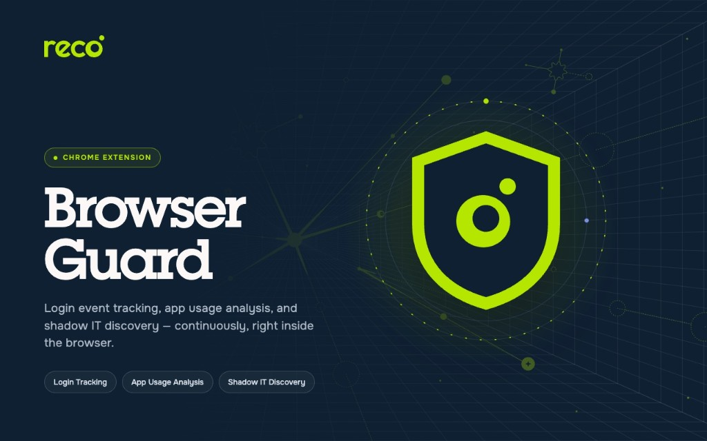

<!--
  SOURCE OF TRUTH. This file is maintained in the private Reco monorepo at
  src/browser-guard/public-repo/README.md and synced to the root of the public
  RecoLabs/browser-guard repo by the "browser-guard release ZIPs" GitHub Action.
  Edit it there, not in the public repo — a direct edit in the public repo is
  overwritten on the next release.
-->

# Reco Browser Guard

**Reco Browser Guard** is an enterprise security extension for **Google Chrome**
and **Microsoft Edge**, deployed by your organization's IT or security team. It
detects authentication events, active sessions, and risky access patterns on
managed employees' browsers and reports them — **end-to-end encrypted** — to your
organization's Reco tenant.

This repository is the **distribution point** for the extension. It hosts the
built, signed artifacts for each version; it does **not** contain the extension's
source code. Every [GitHub Release](../../releases) carries:

| Asset                                | Purpose                                                        |
| ------------------------------------ | -------------------------------------------------------------- |
| `chrome-mv3.crx` / `updates.xml`     | Chrome self-hosted CRX + auto-update feed (MDM force-install)   |
| `edge-mv3.crx` / `edge-updates.xml`  | Edge self-hosted CRX + auto-update feed (MDM force-install)     |
| `browser-guard-<version>-chrome.zip` | Chrome manual-install build (unpacked)                          |
| `browser-guard-<version>-edge.zip`   | Edge manual-install build (unpacked)                            |

All channels share **one permanent extension ID:**
`pliigefhlibccjajneblehcejkajlhoe`.

---

## What it does

- **Login detection** — records when a user signs into a web application
  (password form, OAuth, or SSO redirect): the domain, the username/email
  entered, the login method, and a confidence score. **Passwords are never
  captured.**
- **Session detection** — checks for session cookies and session-related DOM
  elements to determine what a device is authenticated into. Records cookie
  **names only, never cookie values.**
- **Multi-account detection** — flags when more than one account is visible in a
  site's account-switcher UI.
- **SSO attribution** — detects identity-provider redirect chains (Okta,
  Microsoft Entra, Google, Ping, Duo, OneLogin, JumpCloud, CyberArk, Descope,
  Auth0) and attributes the login to the target application.
- **AI prompt metadata** — on `chatgpt.com`, `claude.ai`, `gemini.google.com`,
  `copilot.microsoft.com`, and `perplexity.ai`, records an irreversible SHA-256
  **hash** of the prompt (never the text — see below).
- **Device posture** — computes a device fingerprint (canvas, WebGL, audio,
  screen, CPU, GPU, timezone) so events can be associated with a specific managed
  device.
- **Extension inventory** — once per hour, lists installed extensions so the
  security team can spot risky or unapproved ones. It **never** enables,
  disables, or uninstalls any other extension.
- **Domain blocking (optional)** — redirects IT-flagged domains to a local
  "Access Blocked" page where the user can submit an access request.

## What it does not do

- Does **not** read the contents of web pages beyond the specific signals above.
- Does **not** capture page screenshots, keystrokes outside login forms, or
  cookie/storage values.
- Does **not** capture AI prompt text, AI responses, or conversation history.
- Does **not** collect general browsing history.
- Does **not** contact any third-party service. The only network destination is
  your organization's configured Reco edge-gateway.

## AI prompt metadata

On the five AI sites listed above, the extension observes prompt submissions
(the original request is **never blocked or modified**) and sends only
irreversible metadata:

| Data sent per prompt                       | Data never sent          |
| ------------------------------------------ | ------------------------ |
| SHA-256 hash of the prompt text (64-hex)   | Prompt text              |
| Prompt character length                    | Model response text      |
| Whether attachments are present (boolean)  | Conversation history     |
| Model identifier (e.g. `gpt-4o`)           | Any other page content   |
| SHA-256 hash of the conversation ID        |                          |
| AI platform identifier and hostname        |                          |

The raw prompt text is hashed locally and never leaves the device.

## Security & encryption

- Every event batch is encrypted end-to-end with **HPKE** (DHKEM(X25519) +
  HKDF-SHA256 + **AES-256-GCM**) using your organization's tenant public key.
- The decryption key never leaves your Reco tenant — Reco employees and Reco's
  infrastructure providers cannot read the data.
- Additional Authenticated Data binds each ciphertext to a specific installation
  and key version, preventing replay across installations.
- The extension's X25519 private key is generated once at registration and never
  leaves the browser.
- The extension executes **no** remotely-fetched code (no `eval`, no
  `new Function`, no external scripts, no analytics/telemetry SDKs).

## Permissions

| Permission              | Why it's needed                                                                          |
| ----------------------- | ---------------------------------------------------------------------------------------- |
| `storage`               | Persist installation ID, encryption keys, JWT, and managed config across restarts        |
| `alarms`                | Schedule the periodic beacon flush and hourly posture collection (MV3 timers)            |
| `offscreen`             | Compute canvas/WebGL/audio fingerprints in a hidden DOM document (unavailable in the SW) |
| `declarativeNetRequest` | Redirect IT-blocked domains to the bundled local blocked page (never reads response bodies) |
| `webNavigation`         | Read only top-frame URLs to detect IdP→app SSO redirect chains                           |
| `management`            | Read-only hourly inventory of installed extensions (never mutates other extensions)      |
| `scripting`             | Inject the same declared detector scripts into already-open tabs on service-worker start |
| `identity`              | Resolve the signed-in corporate account email for self-service registration              |
| `<all_urls>` (host)     | Detect logins/sessions across the customer's SaaS stack; the reported domain list is set at runtime by IT |

---

## Choose an installation method

| Method                      | Best for                                 | Auto-updates | Section                                            |
| --------------------------- | ---------------------------------------- | ------------ | -------------------------------------------------- |
| **Chrome Web Store**        | General availability on Chrome           | Yes (Google) | [Chrome Web Store](#method-1--chrome-web-store)    |
| **MDM force-install (CRX)** | Managed fleets (IT-administered rollout) | Yes (feed)   | [MDM force-install](#method-2--mdm-force-install) |
| **Manual install (ZIP)**    | Store-independent / hotfix / single user | No (manual)  | [Manual install](#method-3--manual-install-zip)   |

> If your organization is centrally managed, prefer the **Chrome Web Store** or
> **MDM force-install** method — both auto-update. The **manual ZIP** path is the
> store-independent hotfix option and does not auto-update. Your Reco contact
> will tell you which method applies to your organization.

### Method 1 — Chrome Web Store

The standard install for Chrome users; Google delivers updates automatically.

1. Open the Reco Browser Guard listing on the Chrome Web Store (ask your Reco
   contact for the listing link).
2. Click **Add to Chrome** → **Add extension**.

For managed fleets that track the store, the MDM force-install update URL is
`https://clients2.google.com/service/update2/crx` (see Method 2).

### Method 2 — MDM force-install

For IT administrators rolling out to a managed fleet. Chrome/Edge install the
extension automatically from the self-hosted feed in this repo and keep it up to
date on every new release — no per-version policy change needed.

Add the matching entry to your `ExtensionInstallForcelist` policy
(`extension_id;update_url`):

| Browser | Preference domain    | Forcelist entry                                                                                                       |
| ------- | -------------------- | --------------------------------------------------------------------------------------------------------------------- |
| Chrome  | `com.google.Chrome`  | `pliigefhlibccjajneblehcejkajlhoe;https://github.com/RecoLabs/browser-guard/releases/latest/download/updates.xml`      |
| Edge    | `com.microsoft.Edge` | `pliigefhlibccjajneblehcejkajlhoe;https://github.com/RecoLabs/browser-guard/releases/latest/download/edge-updates.xml` |

To install from the Chrome Web Store instead of the self-hosted CRX, keep the
same extension ID and change only the Chrome update URL to
`https://clients2.google.com/service/update2/crx`.

> **Do not point the same managed fleet at both** the self-hosted feed and the
> Chrome Web Store — pick one update source per fleet. Reco provides the full
> managed-config (registration token, gateway URL, lockdown settings)
> documentation separately.

### Method 3 — Manual install (ZIP)

The store-independent / hotfix path: install or update without waiting on Chrome
Web Store review. Manually-loaded extensions do **not** auto-update — you re-load
a new ZIP to upgrade.

On the [**Releases** page](../../releases/latest), under **Assets**, download the
ZIP matching your browser:

| Browser | Asset                                |
| ------- | ------------------------------------ |
| Chrome  | `browser-guard-<version>-chrome.zip` |
| Edge    | `browser-guard-<version>-edge.zip`   |

> Download the **named ZIP above** — not the "Source code (zip)" / "Source code
> (tar.gz)" entries. Those two are added automatically by GitHub for every
> release and do **not** contain the installable extension.

**Install on Chrome**

1. **Unzip** the `browser-guard-<version>-chrome.zip` into a folder you will keep
   (Chrome loads the extension from this folder — don't delete it).
2. Open `chrome://extensions` in the address bar.
3. Turn on **Developer mode** (toggle, top-right).
4. Click **Load unpacked** and select the unzipped folder.

**Install on Edge**

1. **Unzip** the `browser-guard-<version>-edge.zip` into a folder you will keep
   (Edge loads the extension from this folder — don't delete it).
2. Open `edge://extensions` in the address bar.
3. Turn on **Developer mode** (toggle, left sidebar).
4. Click **Load unpacked** and select the unzipped folder.

**Update to a new version**

1. Download the new version's ZIP and unzip it (overwrite the same folder, or use
   a new one).
2. Open `chrome://extensions` / `edge://extensions`.
3. If you unzipped over the same folder, click **Reload** (↻) on the Browser
   Guard card. If you used a new folder, remove the old entry and **Load
   unpacked** the new one.

The extension keeps its registration across a reload, so no re-registration is
needed for a routine version bump.

---

## Verify the install

- The Browser Guard card on the extensions page shows the installed version and
  the ID `pliigefhlibccjajneblehcejkajlhoe`.
- If your organization provisioned a gateway/registration token (via MDM), the
  extension registers automatically and begins monitoring. Otherwise, open its
  **Options** page to complete self-service registration (gateway URL,
  registration token, corporate email).

## Requirements

- Google Chrome or Microsoft Edge, **version 116 or newer**.

## Privacy policy

<https://reco.ai/privacy-policy>

## Support

Contact your Reco representative for the gateway URL, registration token, and any
installation help. This repository contains release artifacts only — please do
not open issues here.
